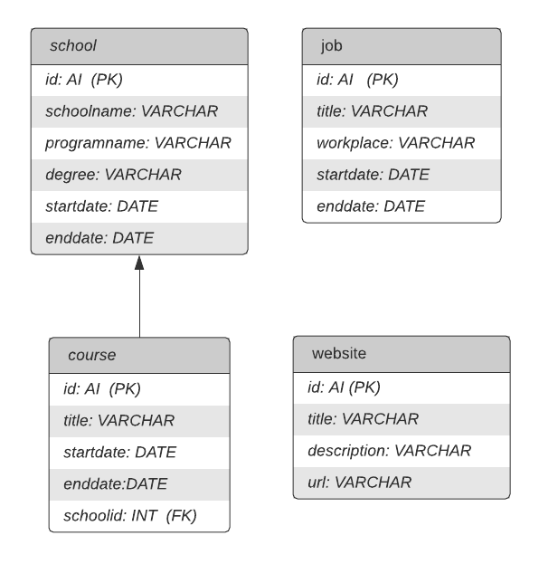

# Projekt - Webbtjänst
## Av Therese Bruzell

### Projektet
Detta projekt är en REST-webbtjänst för att presentera innehållet i en databas som innehåller information passande ett CV.

### Använda projektet
För att använda detta projekt behövs en databas liknande detta uml-diagram 

Webbtjänsten har full CRUD-funktionalitet och använder sig av parametrarna school, course, job och website för att manövrera till de olika tabellerna. 

Vill du exempelvis nå course med id 3 skrivs detta i följande format:
"url_till_api?course&id=3"

För att webbtjänsten ska fungera måste en klass vid namn DBHandler läggas till med följande information:
Databasuppkopplingen lagrad i klassen genom metoden connect().
Metod vid namn getConnection() som returnerar uppkopplingen.
Metod vid namn closeConnection() som stänger uppkopplingen. 
 
För att sedan hantera innehållet behövs en adminsida göras liknande detta repot:
https://github.com/TheraBru/webb3-project-admin

